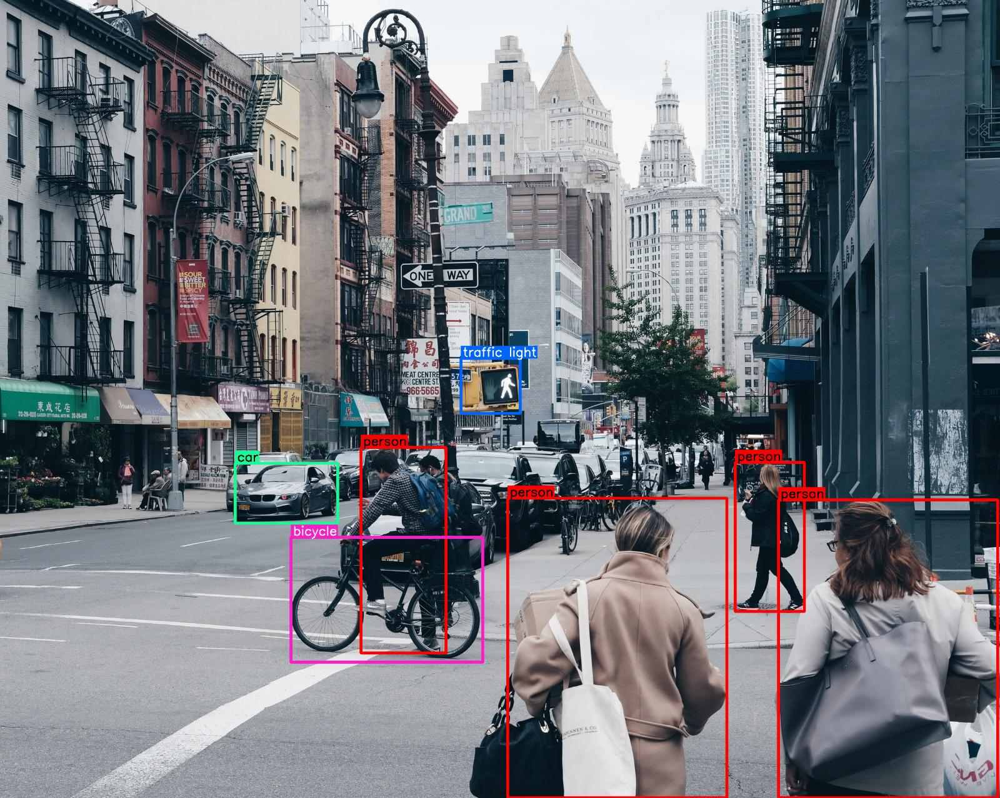
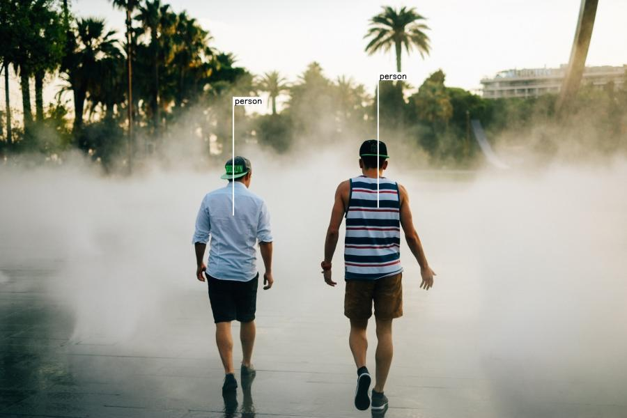

# bbox-visualizer

This package helps users draw bounding boxes around objects, without doing the clumsy math that you'd need to do for positioning the labels. It also has a few different types of visualizations you can use for labeling objects after identifying them.

The bounding box points are expected in the format: `(xmin, ymin, xmax, ymax)`

* Documentation: https://bbox-visualizer.readthedocs.io.
* Free software: MIT license

## Installation:
    pip install bbox-visualizer

## Usage:
    
    import bbox_visualizer as bbv

#### Photos by [Joshua Earle](https://unsplash.com/@joshuaearle), [Jonas Weckschmied](https://unsplash.com/@jweckschmied) and [Sherzod Max](https://unsplash.com/@sherzodmax) on [Unsplash](https://unsplash.com).  

|                                                 **image**                                                  |                                                    **function**                                                    |
|:----------------------------------------------------------------------------------------------------------:|:------------------------------------------------------------------------------------------------------------------:|
|                              |                  bbv.draw_rectangle(img, bbox) bbv.add_label(img, label, bbox, top=True)                  |
|                                     |                      bbv.draw_rectangle(img, bbox) bbv.add_T_label(img, label, bbox)                      |
|  |                                     bbv.draw_flag_with_label(img, label, bbox)                                     |
|                           |                 bbv.draw_rectangle(img, bbox) bbv.add_label(img, label, bbox, top=False)                  |
|            | bbv.draw_rectangle(image, bbox, is_opaque=True) bbv.add_label(img, label, bbox, draw_bg=False, top=False) |
|            | bbv.draw_multiple_rectangles(img, bboxes) bbv.add_multiple_labels(img, labels, bboxes) |
|            | bbv.draw_multiple_flags_with_labels(img, labels, bboxes) |
|            | bbv.draw_multiple_rectangles(img, bboxes) bbv.add_multiple_T_labels(img, labels, bboxes) |

## There are *optional* functions that can draw multiple bounding boxes and/or write multiple labels on the same image, but it is advisable to use the above functions in a loop in order to have full control over your visualizations.

* bbv.draw_multiple_rectangles(img, bboxes)
* bbv.add_multiple_labels(img, labels, bboxes)
* bbv.add_multiple_T_labels(img, labels, bboxes)
* bbv.draw_multiple_flags_with_labels(img, labels, bboxes)

`bboxes` and `labels` are lists in the above examples.

#### Credits

This package was created with Cookiecutter and the `audreyr/cookiecutter-pypackage` project template.
