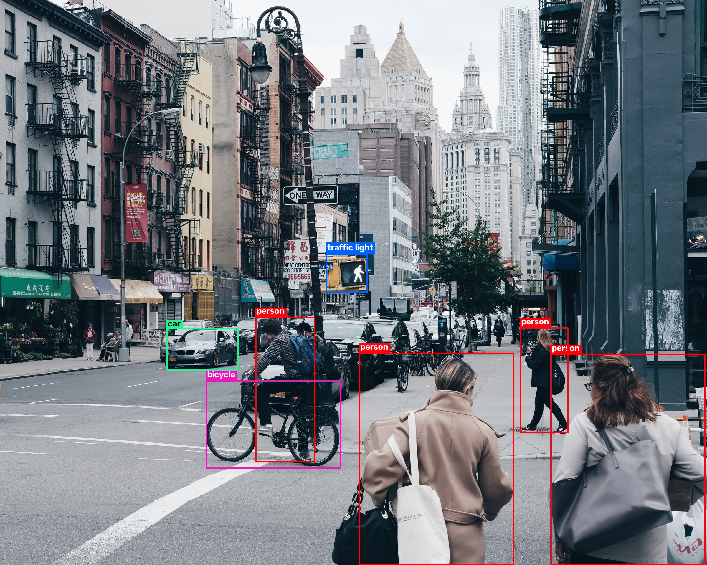
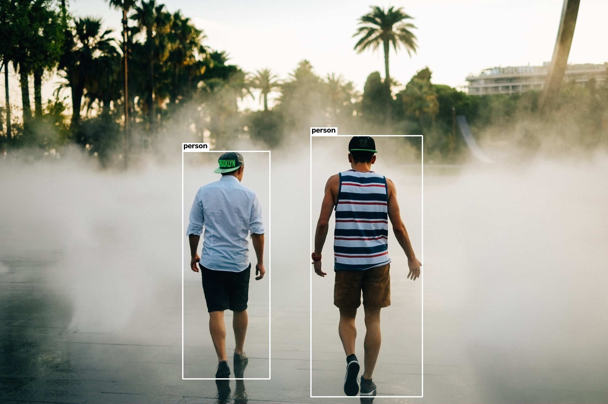
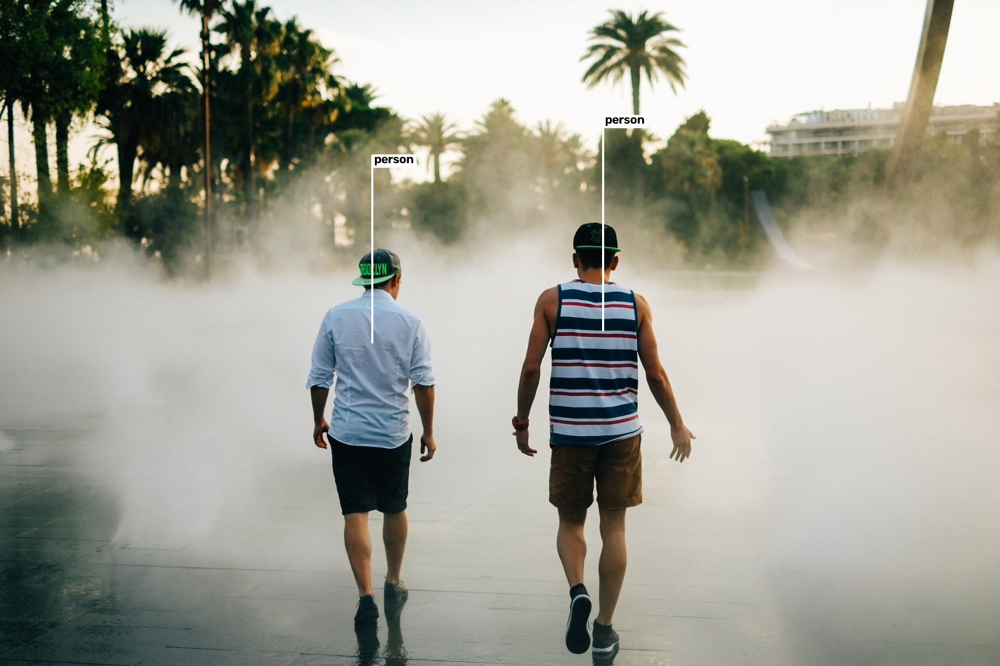

# bbox-visualizer

[](https://bbox-visualizer.readthedocs.io/en/latest/?badge=latest)
[](https://github.com/shoumikchow/bbox-visualizer/actions/workflows/test.yml)
[](https://opensource.org/licenses/MIT)
[](https://github.com/astral-sh/ruff)
[](https://badge.fury.io/py/bbox-visualizer)
[](https://pepy.tech/project/bbox-visualizer)


This package helps users draw bounding boxes around objects, without doing the clumsy math that you'd need to do for positioning the labels. It also has a few different types of visualizations you can use for labeling objects after identifying them.

By default the bounding box points are expected in Pascal VOC format: `(xmin, ymin, xmax, ymax)`. COCO and YOLO formats are also supported via the `bbox_format` keyword argument (see [Bounding box formats](#bounding-box-formats)).

* Documentation: https://bbox-visualizer.readthedocs.io.
* Free software: MIT license


## Installation:
    pip install bbox-visualizer

## Quick Start

A complete example that loads an image, draws a labeled bounding box, and saves the result:

```python
import cv2
import bbox_visualizer as bbv

img = cv2.imread("path/to/image.jpg")

# Bounding boxes use [x_min, y_min, x_max, y_max]
bbox = [150, 100, 450, 300]
label = "person"

img = bbv.draw_box(img, bbox, bbox_color=(0, 255, 0))
img = bbv.add_label(img, label, bbox)

cv2.imwrite("output.jpg", img)
```

For multiple objects, use the `_multiple_` variants with parallel lists:

```python
bboxes = [[150, 100, 450, 300], [500, 50, 700, 250]]
labels = ["person", "dog"]

img = bbv.draw_multiple_boxes(img, bboxes)
img = bbv.add_multiple_labels(img, labels, bboxes)
```

## Bounding box formats

Every drawing function accepts a `bbox_format` keyword argument. The default is
Pascal VOC.

| `bbox_format` | Coordinates | Scale |
|---------------|-------------|-------|
| `"voc"` (default) | `[x_min, y_min, x_max, y_max]` | absolute pixels |
| `"coco"` | `[x_min, y_min, width, height]` | absolute pixels |
| `"yolo"` | `[x_center, y_center, width, height]` | normalized to `[0, 1]` |

```python
# COCO format: [x_min, y_min, width, height]
img = bbv.draw_box(img, [150, 100, 300, 200], bbox_format="coco")

# YOLO format: [x_center, y_center, width, height], normalized to [0, 1].
# Image dimensions are read from the image, so no extra arguments are needed.
img = bbv.draw_box(img, [0.5, 0.4, 0.3, 0.25], bbox_format="yolo")

# Works with the multiple-object variants too
img = bbv.draw_multiple_boxes(img, coco_bboxes, bbox_format="coco")
```

Internally all formats are converted to Pascal VOC before drawing.

Runnable scripts live in [`examples/`](examples):
- `quickstart.py` — minimal example on a blank canvas
- `single_object.py` — every single-object label style
- `multiple_objects.py` — every multi-object label style





#### Photos by [Joshua Earle](https://unsplash.com/@joshuaearle), [Jonas Weckschmied](https://unsplash.com/@jweckschmied) and [Sherzod Max](https://unsplash.com/@sherzodmax) on [Unsplash](https://unsplash.com).  

|                                                 **image**                                                  |                                                    **function**                                                    |
|:----------------------------------------------------------------------------------------------------------:|:------------------------------------------------------------------------------------------------------------------:|
|                              |                  img = bbv.draw_box(img, bbox)<br>img = bbv.add_label(img, label, bbox, top=True)                  |
|                                     |                      img = bbv.draw_box(img, bbox)<br>img = bbv.add_T_label(img, label, bbox)                      |
|  |                                     img = bbv.draw_flag_with_label(img, label, bbox)                                     |
|                           |                 img = bbv.draw_box(img, bbox)<br>img = bbv.add_label(img, label, bbox, top=False)                  |
|            | img = bbv.draw_box(image, bbox, is_opaque=True)<br>img = bbv.add_label(img, label, bbox, draw_bg=False, top=False) |
|            | img = bbv.draw_multiple_boxes(img, bboxes)<br>img = bbv.add_multiple_labels(img, labels, bboxes) |
|            | img = bbv.draw_multiple_flags_with_labels(img, labels, bboxes) |
|            | img = bbv.draw_multiple_boxes(img, bboxes)<br>img = bbv.add_multiple_T_labels(img, labels, bboxes) |

> **Note:** The functions `draw_rectangle` and `draw_multiple_rectangles` are also available as aliases for `draw_box` and `draw_multiple_boxes` respectively. Both naming conventions work identically.

> **Tip:** The `draw_multiple_*` and `add_multiple_*` functions are convenience helpers. For full control over your visualizations, call the single-box functions (`draw_box`, `add_label`, etc.) in a loop instead.
